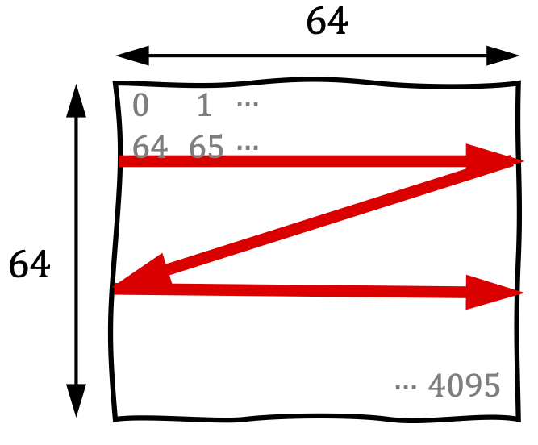
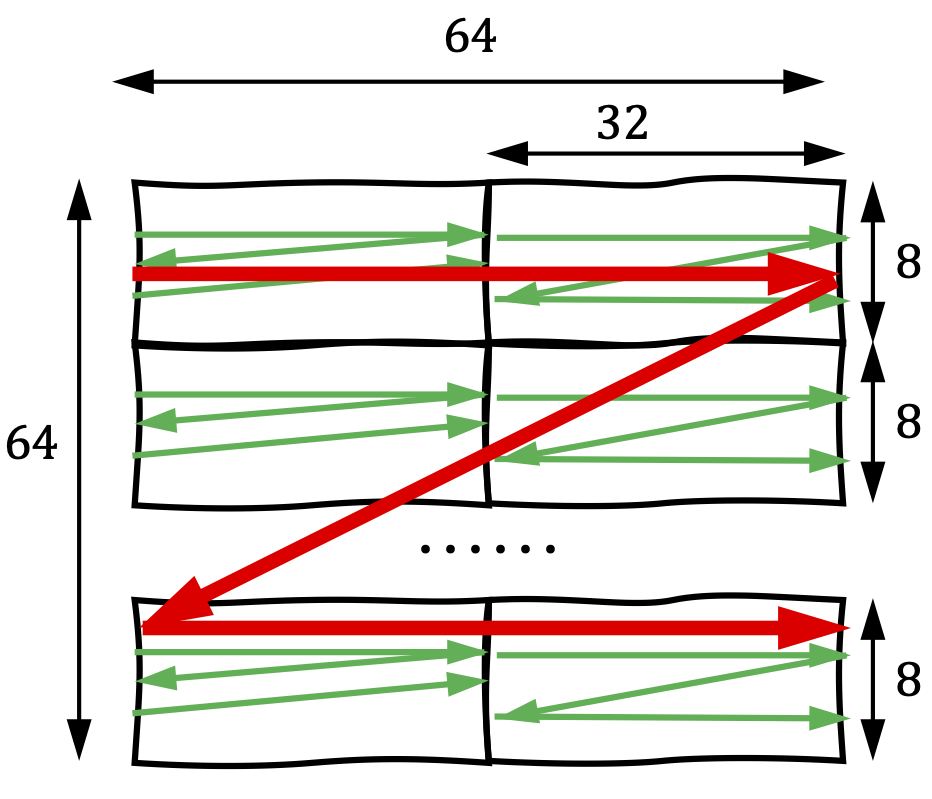
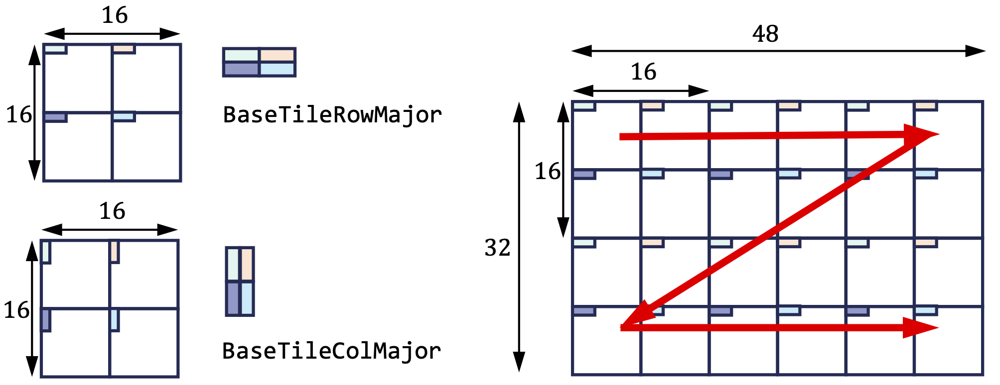
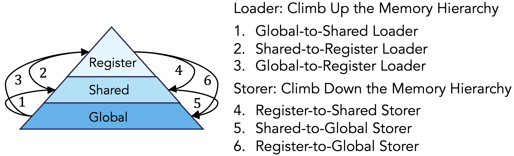

TileFusion operates on four core concepts: `Tile`, `Layout`, `TileIterator`, and `Loader/Storer`, which facilitate the transfer of tiles between memory hierarchies.

## Types

Core types in TileFusion are defined in the [types](https://github.com/microsoft/TileFusion/tree/master/include/types) directory.

### Tile

A tile is a 1D (vector) or 2D (matrix) array that resides within one of the three GPU memory hierarchies. A tile is typically characterized by three attributes:

- **Shape**: The dimensions of the tile, specified by the number of elements along each axis.
- **Layout**: Layout is a parameterized function that maps a tuple of integer coordinates (representing the elements in the tile) to an integer. The lexicographical order of these coordinates can determine the sequence of elements within the tile.
- **ElementType**: The data type of the elements stored in the tile.

Based on the memory hierarchy where a tile resides, there are three different variants: [GlobalTile](https://github.com/microsoft/TileFusion/blob/master/include/types/global.hpp), [SharedTile](https://github.com/microsoft/TileFusion/blob/master/include/types/shared.hpp), and [RegTile](https://github.com/microsoft/TileFusion/blob/master/include/types/register.hpp).

#### Global Memory Tile

A 2D tile in global memory with a shape of `[64, 64]`, a `RowMajor` layout, and a `float` element type can be defined as follows:

```cpp
using Global = GlobalTile<64, 64, RowMajor, float>;
```

#### Shared Memory Tile

To define an equivalent tile located in shared memory:

```cpp
// `is_swizzled = true` indicates the tile is swizzled in shared memory,
// which is a common practice to enhance shared memory access performance.
// The default value is false, which simplifies debugging.
using Shared = SharedTile<float, RowMajor<64, 64>, is_swizzled=true>;
```

#### Register File Tile

For tiles located in the register file, the definition differs slightly. In CUDA, registers are thread-local. Consequently, when the aforementioned tile is located in the register file, it is partitioned across threads in the CTA. Therefore, the register tile held by an individual thread is defined as follows:

```cpp
using Reg = RegTile<BaseTileRowMajor<float>, RowMajor<4, 4>>;
```

We will further discuss the second parameter of `RegTile` in the next section: **Tile Layout**.

### Tile Layout

The shape of a tile defines a high-dimensional space, where each coordinate in this space can be represented by an integer tuple. A Tile Layout is a function that maps this integer tuple to an integer, providing a comprehensive and logical description of data, threads, warps, and other resources. In TileFusion, there are three types of layouts: **Matrix Layout**, **Tiled Matrix Layout**, and **Register Tile Layout**.

These three layouts are inter-composable, but an important simplification we made is that arbitrary nested composability is not supported; composition can be performed only once.

#### Matrix Layout

Matrix Layout is characterized by shape and strides, this layout has two specializations: Row-major and Column-major. It is used for the efficient access of global and shared memory tiles.

<div align="center">
  <br>
  Fig 1: The matrix layout used for the global and shared memory tiles.
</div>

Shown in Figure 1, Matrix Layout is characterized by shape and strides. This layout has two specializations: Row-major and Column-major. It is used for the efficient access of global and shared memory tiles.

#### Tiled Matrix Layout

Tiled matrix layout can be understood as a matrix layout composed with another matrix layout. This layout facilitates the efficient access of shared memory tiles or describes the thread or warp layout.

<div align="center">
  <br>
  Fig 2: The tiled matrix layout used for the shared memory tile.
</div>
<br>

Shown in Figure 2, Tiled matrix layout can be understood as a matrix layout composed with another matrix layout. This layout facilitates the efficient access of shared memory tiles or describes the thread or warp layout.

#### Register Tile Layout

Register Tile Layout is designed for the efficient access of TensorCore register tiles.

<div align="center">
  <br>
  Fig 3: The TensorCore register tile layout.
</div>

Shown in Figure 3, the `BaseTileRowMajor` and `BaseTileColumnMajor` are specialized layouts designed for Tensor Core MMA operations. These register layouts combine a BaseTileMatrixLayout with a matrix layout. The rule here is that **arbitrary nested composability isn't supported; composition can only be performed once**.

### GlobalTileIterator and SharedTileIterator

TileIterator provides syntactic interfaces for defining tile partitions, facilitating the systematic traversal of tiles. It has two variants: `GTileIterator` and `STileIterator`.

```cpp
using GlobalA = GlobalTile<InType, tl::RowMajor<kTM, kK, kK>>;
using GIteratorA = GTileIterator<GlobalA, TileShape<kTM, kTK>>;

using SharedA = SharedTile<InType, tl::RowMajor<kTM, kTK>>;
using SIteratorA = STileIterator<SharedA, TileShape<kTM, kRK>>;
```

<div align="center">
  <br>
  Fig 4: Partition tensor using a tile iterator.
</div>

Given that a tile represents a larger data region, the tile shape specifies the dimensions of a smaller tile. The TileIterator then divides the larger tile into smaller tiles along each dimension.

## Tile Transfer with Loader and Storer

<div align="center">
  <br>
  Fig 5: A tile is transferred between memory hierarchies using a loader and a storer.
</div>

Loaders and Storers use cooperative threads to transfer a tile from the source to the target location. They operate at the CTA level and accept the following inputs: Warp Layout, Target Tile, and Source Tile. Based on these parameters, they automatically infer a copy plan that partitions the data transfer work among the threads.
